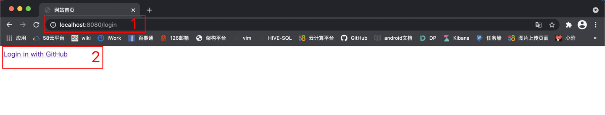

# Github OAuth2 Login Application

> 我的oauth2登陆服务
> github登陆第三方服务

## 操作流程

- GithubOauth2Application main方法 启动项目
- 访问：http://localhost:8080/login
- 点击 Login in with GitHub 跳转认证页面
  
- 点击同意
- 看到HelloWorld表示成功登陆

## 注意事项

- 偶尔会出现异常如下，解决办法：不用管。多试几次就好了，看网上说是证书的问题。我觉得不是。

```text
2021-04-21 15:52:40.645 ERROR 33209 --- [nio-8080-exec-5] o.a.c.c.C.[.[.[/].[dispatcherServlet]    : Servlet.service() for servlet [dispatcherServlet] in context with path [] threw exception [Request processing failed; nested exception is org.springframework.web.client.ResourceAccessException: I/O error on GET request for "https://api.github.com/user": Remote host terminated the handshake; nested exception is javax.net.ssl.SSLHandshakeException: Remote host terminated the handshake] with root cause

java.io.EOFException: SSL peer shut down incorrectly
	at sun.security.ssl.SSLSocketInputRecord.read(SSLSocketInputRecord.java:480) ~[na:1.8.0_281]
	at sun.security.ssl.SSLSocketInputRecord.readHeader(SSLSocketInputRecord.java:469) ~[na:1.8.0_281]
	at sun.security.ssl.SSLSocketInputRecord.decode(SSLSocketInputRecord.java:159) ~[na:1.8.0_281]
	at sun.security.ssl.SSLTransport.decode(SSLTransport.java:110) ~[na:1.8.0_281]
	at sun.security.ssl.SSLSocketImpl.decode(SSLSocketImpl.java:1279) ~[na:1.8.0_281]
	at sun.security.ssl.SSLSocketImpl.readHandshakeRecord(SSLSocketImpl.java:1188) ~[na:1.8.0_281]
	at sun.security.ssl.SSLSocketImpl.startHandshake(SSLSocketImpl.java:401) ~[na:1.8.0_281]
	at sun.security.ssl.SSLSocketImpl.startHandshake(SSLSocketImpl.java:373) ~[na:1.8.0_281]
	at sun.net.www.protocol.https.HttpsClient.afterConnect(HttpsClient.java:587) ~[na:1.8.0_281]
	at sun.net.www.protocol.https.AbstractDelegateHttpsURLConnection.connect(AbstractDelegateHttpsURLConnection.java:185) ~[na:1.8.0_281]
	at sun.net.www.protocol.https.HttpsURLConnectionImpl.connect(HttpsURLConnectionImpl.java:167) ~[na:1.8.0_281]
	at org.springframework.http.client.SimpleBufferingClientHttpRequest.executeInternal(SimpleBufferingClientHttpRequest.java:76) ~[spring-web-5.3.6.jar:5.3.6]
	at org.springframework.http.client.AbstractBufferingClientHttpRequest.executeInternal(AbstractBufferingClientHttpRequest.java:48) ~[spring-web-5.3.6.jar:5.3.6]
	at org.springframework.http.client.AbstractClientHttpRequest.execute(AbstractClientHttpRequest.java:66) ~[spring-web-5.3.6.jar:5.3.6]
	at org.springframework.web.client.RestTemplate.doExecute(RestTemplate.java:776) ~[spring-web-5.3.6.jar:5.3.6]
	at org.springframework.web.client.RestTemplate.execute(RestTemplate.java:711) ~[spring-web-5.3.6.jar:5.3.6]
	at org.springframework.web.client.RestTemplate.exchange(RestTemplate.java:602) ~[spring-web-5.3.6.jar:5.3.6]
	at com.ning.geekbang.github_oauth2.controller.LoginController.getUserInfo(LoginController.java:106) ~[classes/:na]
	at com.ning.geekbang.github_oauth2.controller.LoginController.callback(LoginController.java:48) ~[classes/:na]
	at sun.reflect.NativeMethodAccessorImpl.invoke0(Native Method) ~[na:1.8.0_281]
	at sun.reflect.NativeMethodAccessorImpl.invoke(NativeMethodAccessorImpl.java:62) ~[na:1.8.0_281]
	at sun.reflect.DelegatingMethodAccessorImpl.invoke(DelegatingMethodAccessorImpl.java:43) ~[na:1.8.0_281]
	at java.lang.reflect.Method.invoke(Method.java:498) ~[na:1.8.0_281]
	at org.springframework.web.method.support.InvocableHandlerMethod.doInvoke(InvocableHandlerMethod.java:197) ~[spring-web-5.3.6.jar:5.3.6]
	at org.springframework.web.method.support.InvocableHandlerMethod.invokeForRequest(InvocableHandlerMethod.java:141) ~[spring-web-5.3.6.jar:5.3.6]
	at org.springframework.web.servlet.mvc.method.annotation.ServletInvocableHandlerMethod.invokeAndHandle(ServletInvocableHandlerMethod.java:106) ~[spring-webmvc-5.3.6.jar:5.3.6]
	at org.springframework.web.servlet.mvc.method.annotation.RequestMappingHandlerAdapter.invokeHandlerMethod(RequestMappingHandlerAdapter.java:894) ~[spring-webmvc-5.3.6.jar:5.3.6]
	at org.springframework.web.servlet.mvc.method.annotation.RequestMappingHandlerAdapter.handleInternal(RequestMappingHandlerAdapter.java:808) ~[spring-webmvc-5.3.6.jar:5.3.6]
	at org.springframework.web.servlet.mvc.method.AbstractHandlerMethodAdapter.handle(AbstractHandlerMethodAdapter.java:87) ~[spring-webmvc-5.3.6.jar:5.3.6]
	at org.springframework.web.servlet.DispatcherServlet.doDispatch(DispatcherServlet.java:1060) ~[spring-webmvc-5.3.6.jar:5.3.6]
	at org.springframework.web.servlet.DispatcherServlet.doService(DispatcherServlet.java:962) ~[spring-webmvc-5.3.6.jar:5.3.6]
	at org.springframework.web.servlet.FrameworkServlet.processRequest(FrameworkServlet.java:1006) ~[spring-webmvc-5.3.6.jar:5.3.6]
	at org.springframework.web.servlet.FrameworkServlet.doGet(FrameworkServlet.java:898) ~[spring-webmvc-5.3.6.jar:5.3.6]
	at javax.servlet.http.HttpServlet.service(HttpServlet.java:626) ~[tomcat-embed-core-9.0.45.jar:4.0.FR]
	at org.springframework.web.servlet.FrameworkServlet.service(FrameworkServlet.java:883) ~[spring-webmvc-5.3.6.jar:5.3.6]
	at javax.servlet.http.HttpServlet.service(HttpServlet.java:733) ~[tomcat-embed-core-9.0.45.jar:4.0.FR]
	at org.apache.catalina.core.ApplicationFilterChain.internalDoFilter(ApplicationFilterChain.java:227) ~[tomcat-embed-core-9.0.45.jar:9.0.45]
	at org.apache.catalina.core.ApplicationFilterChain.doFilter(ApplicationFilterChain.java:162) ~[tomcat-embed-core-9.0.45.jar:9.0.45]
	at org.apache.tomcat.websocket.server.WsFilter.doFilter(WsFilter.java:53) ~[tomcat-embed-websocket-9.0.45.jar:9.0.45]
	at org.apache.catalina.core.ApplicationFilterChain.internalDoFilter(ApplicationFilterChain.java:189) ~[tomcat-embed-core-9.0.45.jar:9.0.45]
	at org.apache.catalina.core.ApplicationFilterChain.doFilter(ApplicationFilterChain.java:162) ~[tomcat-embed-core-9.0.45.jar:9.0.45]
	at org.springframework.web.filter.RequestContextFilter.doFilterInternal(RequestContextFilter.java:100) ~[spring-web-5.3.6.jar:5.3.6]
	at org.springframework.web.filter.OncePerRequestFilter.doFilter(OncePerRequestFilter.java:119) ~[spring-web-5.3.6.jar:5.3.6]
	at org.apache.catalina.core.ApplicationFilterChain.internalDoFilter(ApplicationFilterChain.java:189) ~[tomcat-embed-core-9.0.45.jar:9.0.45]
	at org.apache.catalina.core.ApplicationFilterChain.doFilter(ApplicationFilterChain.java:162) ~[tomcat-embed-core-9.0.45.jar:9.0.45]
	at org.springframework.web.filter.FormContentFilter.doFilterInternal(FormContentFilter.java:93) ~[spring-web-5.3.6.jar:5.3.6]
	at org.springframework.web.filter.OncePerRequestFilter.doFilter(OncePerRequestFilter.java:119) ~[spring-web-5.3.6.jar:5.3.6]
	at org.apache.catalina.core.ApplicationFilterChain.internalDoFilter(ApplicationFilterChain.java:189) ~[tomcat-embed-core-9.0.45.jar:9.0.45]
	at org.apache.catalina.core.ApplicationFilterChain.doFilter(ApplicationFilterChain.java:162) ~[tomcat-embed-core-9.0.45.jar:9.0.45]
	at org.springframework.web.filter.CharacterEncodingFilter.doFilterInternal(CharacterEncodingFilter.java:201) ~[spring-web-5.3.6.jar:5.3.6]
	at org.springframework.web.filter.OncePerRequestFilter.doFilter(OncePerRequestFilter.java:119) ~[spring-web-5.3.6.jar:5.3.6]
	at org.apache.catalina.core.ApplicationFilterChain.internalDoFilter(ApplicationFilterChain.java:189) ~[tomcat-embed-core-9.0.45.jar:9.0.45]
	at org.apache.catalina.core.ApplicationFilterChain.doFilter(ApplicationFilterChain.java:162) ~[tomcat-embed-core-9.0.45.jar:9.0.45]
	at org.apache.catalina.core.StandardWrapperValve.invoke(StandardWrapperValve.java:202) ~[tomcat-embed-core-9.0.45.jar:9.0.45]
	at org.apache.catalina.core.StandardContextValve.invoke(StandardContextValve.java:97) [tomcat-embed-core-9.0.45.jar:9.0.45]
	at org.apache.catalina.authenticator.AuthenticatorBase.invoke(AuthenticatorBase.java:542) [tomcat-embed-core-9.0.45.jar:9.0.45]
	at org.apache.catalina.core.StandardHostValve.invoke(StandardHostValve.java:143) [tomcat-embed-core-9.0.45.jar:9.0.45]
	at org.apache.catalina.valves.ErrorReportValve.invoke(ErrorReportValve.java:92) [tomcat-embed-core-9.0.45.jar:9.0.45]
	at org.apache.catalina.core.StandardEngineValve.invoke(StandardEngineValve.java:78) [tomcat-embed-core-9.0.45.jar:9.0.45]
	at org.apache.catalina.connector.CoyoteAdapter.service(CoyoteAdapter.java:357) [tomcat-embed-core-9.0.45.jar:9.0.45]
	at org.apache.coyote.http11.Http11Processor.service(Http11Processor.java:374) [tomcat-embed-core-9.0.45.jar:9.0.45]
	at org.apache.coyote.AbstractProcessorLight.process(AbstractProcessorLight.java:65) [tomcat-embed-core-9.0.45.jar:9.0.45]
	at org.apache.coyote.AbstractProtocol$ConnectionHandler.process(AbstractProtocol.java:893) [tomcat-embed-core-9.0.45.jar:9.0.45]
	at org.apache.tomcat.util.net.NioEndpoint$SocketProcessor.doRun(NioEndpoint.java:1707) [tomcat-embed-core-9.0.45.jar:9.0.45]
	at org.apache.tomcat.util.net.SocketProcessorBase.run(SocketProcessorBase.java:49) [tomcat-embed-core-9.0.45.jar:9.0.45]
	at java.util.concurrent.ThreadPoolExecutor.runWorker(ThreadPoolExecutor.java:1149) [na:1.8.0_281]
	at java.util.concurrent.ThreadPoolExecutor$Worker.run(ThreadPoolExecutor.java:624) [na:1.8.0_281]
	at org.apache.tomcat.util.threads.TaskThread$WrappingRunnable.run(TaskThread.java:61) [tomcat-embed-core-9.0.45.jar:9.0.45]
	at java.lang.Thread.run(Thread.java:748) [na:1.8.0_281]

```

